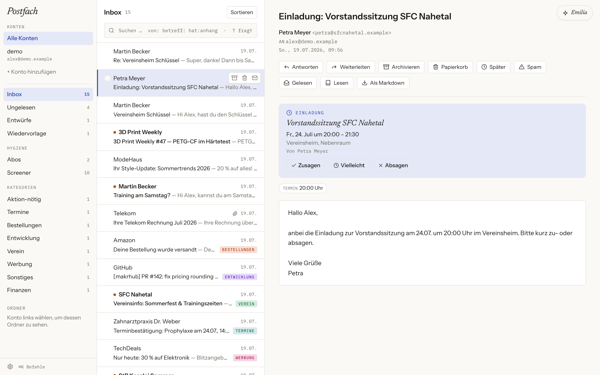
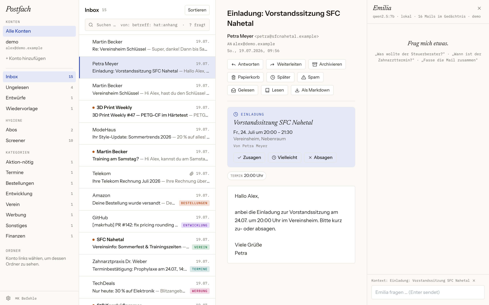
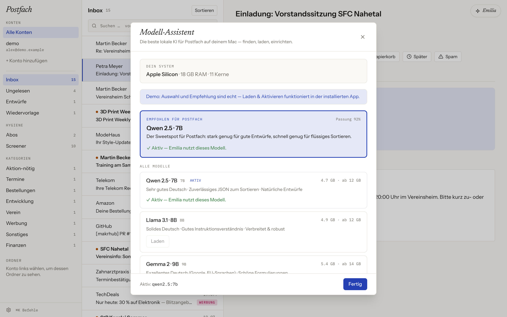
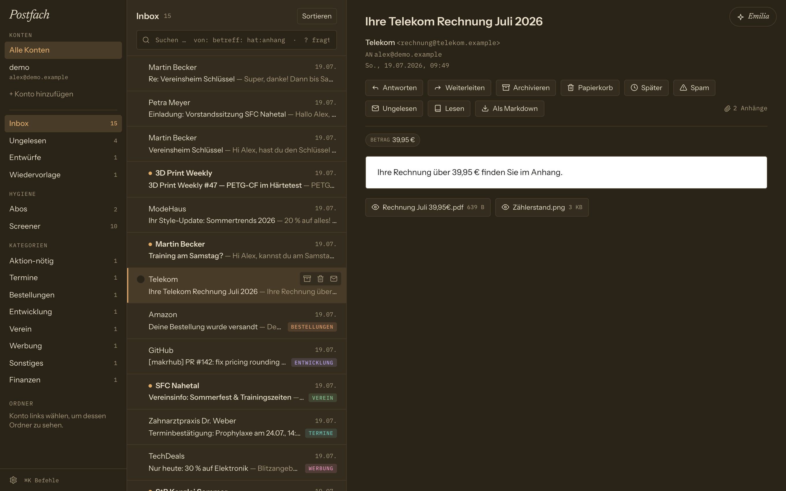

# Postfach

A local-first mail app in the spirit of Notion Mail — for any IMAP account
(self-hosted, GMX, web.de, Gmail, …). Everything runs on your own Mac
(`127.0.0.1:8722`). No account required to try it, **no telemetry**, and by
default **no cloud** — the AI runs entirely on your machine via Ollama.



**Emilia**, the built-in AI copilot, runs entirely locally through
[Ollama](https://ollama.com): answer questions about your mailbox (with source
chips), rewrite drafts in your own tone, search in plain German, summarize long
threads — all offline. Press ⌘J to open her.



Emilia needs a model. You don't have to hunt one down: the **model assistant**
scans your Mac, recommends the one that fits Postfach *and* your RAM, and sets up
Ollama itself — no manual download, no admin rights.



Six colour palettes, each in light and dark — and the mail itself always stays on
light paper, because that's what mail is designed for.



## Public beta — read this first

A solo hobby project, published early. It works and its author uses it daily,
but expect rough edges.

- **Young software.** It never hard-deletes mail — moving to trash is the worst
  it can do, and `backend/tests/test_safety.py` enforces that. Even so: don't
  let Postfach be the only thing standing between you and mail you can't lose.
- **macOS only**, and the released binary is **Apple Silicon (M1 or newer)**.
  Intel Macs have to [build from source](#build-from-source). Minimum macOS
  version: **12.0 (Monterey)**.
- **The app is German.** UI, error messages and the manual are German — see the
  [**Wiki**](https://github.com/tristanrathgeber/postfach/wiki), which explains
  every function from first steps to every keyboard shortcut (same content as
  [`docs/HANDBUCH.md`](docs/HANDBUCH.md), just navigable). This README is the
  only English part; there is no English UI yet.
- **The app is unsigned** — there's no paid Apple developer account behind it —
  so macOS refuses the first launch. Two clicks fix it, see
  [Install](#install-as-a-mac-app).
- **AI features need [Ollama](https://ollama.com)** running locally. Without it
  Postfach is a plain mail client: sorting, chat and summaries are simply
  unavailable, nothing breaks.
- **Tested mostly against one GMX account** (the author's). The other IMAP
  providers are implemented and unit-tested, but far less exercised in real
  life. Bug reports are the most useful thing you can send.
- **Where your data lives:** mail index and settings in
  `~/Library/Application Support/Postfach`, passwords in the macOS Keychain.

## Privacy — verifiable, not just promised

Postfach makes **no network connection you didn't ask for.** There is no
analytics, no crash reporting, no phone-home. You can check this yourself:

| Where it connects | When | What for |
|---|---|---|
| Your mail provider (IMAP/SMTP) | while the app runs (IMAP IDLE push) + when you send | fetching and sending your mail |
| `localhost:11434` (Ollama) | Emilia, and local sort/draft (default) | the local AI model — never leaves your Mac |
| The unsubscribe host | only when you click "unsubscribe" (RFC-8058 one-click) | the sender's own unsubscribe endpoint |
| GitHub releases API | **only** when you click "Check for updates" | comparing your version to the latest |
| A cloud AI provider (Anthropic) | **only if** you turn off `sort_local`/`draft_local` | classifying/drafting — this sends mail content to the cloud |

The **About dialog** (⌘K → "Über Postfach") and `GET /api/network-info` list
exactly these targets at runtime — including the cloud AI host **if** you've
opted into it, so the panel can never quietly lie. `backend/tests/test_appreife.py`
asserts no telemetry/analytics package is imported anywhere. Out of the box, the
only outbound traffic is to your own mail server; everything else is a local call
(Ollama) or triggered by an explicit click.

**AI boundaries (test-enforced):** the AI classifies and drafts — it never sends,
moves, or deletes. Sending happens only when *you* click. Passwords live in the
macOS Keychain, never in a config file, log, or the search index. See
`backend/tests/test_safety.py`.

## Install as a Mac app

A self-contained bundle with an embedded Python — no uv, Node or toolchain
needed to run it. Cold start ~0.5 s, ~145 MB idle.

1. Download the `.dmg` from the
   [latest release](https://github.com/tristanrathgeber/postfach/releases/latest)
   — **Apple Silicon (M1 or newer)**, macOS 12 or later.
2. Double-click it and **drag "Postfach" onto "Programme"**. That's the install —
   no unzipping, no terminal. (The same steps sit in the image as
   "Zuerst lesen.txt".)
3. Open it once from Applications. macOS will refuse, because the app is unsigned
   (notarizing requires a paid Apple developer account this project doesn't have).
4. Open **System Settings → Privacy & Security**, scroll down to the note about
   Postfach, and click **"Open Anyway"**. Confirm — that's a one-time step.

Right-click → Open no longer bypasses Gatekeeper on current macOS, so ignore
that advice if you find it elsewhere. Terminal equivalent, if you prefer it:
`xattr -dr com.apple.quarantine /Applications/Postfach.app`.

From there the app takes over: on first start it opens the account dialog by
itself — pick your provider, the server settings fill in, the password goes
straight to the Keychain. No YAML editing.

For Emilia, install [Ollama](https://ollama.com). You don't have to pick a model
by hand: open the **Model Assistant** (⌘K → "Modell-Assistent"), which scans your
Mac, recommends the model that best fits Postfach *and* runs on your RAM, and
downloads + activates it in one click. (Manual route: `ollama pull qwen2.5:7b` for
chat/sorting and `ollama pull jina/jina-embeddings-v2-base-de` for Emilia's memory —
a German embedding model, since the mail it has to understand is German.)

## Build from source

Requirements to *build*: macOS, [uv](https://docs.astral.sh/uv/), Node.js ≥ 20.

```bash
# 1. Clone both repos SIDE BY SIDE, into the same parent directory.
git clone https://github.com/tristanrathgeber/email-agent
git clone https://github.com/tristanrathgeber/postfach

# 2. One command builds everything: frontend, icon, PyInstaller bundle.
cd postfach && ./scripts/build_app.sh     # → dist/Postfach.app

# 3. Install it.
cp -r dist/Postfach.app /Applications/
```

(Why two repos: the mail/LLM intelligence lives in `email-agent`, which Postfach
pulls in as a **path dependency** — `../../email-agent` in
`backend/pyproject.toml`. CI does exactly the same, see
`.github/workflows/ci.yml`.)

**Troubleshooting — `uv sync` fails, or `email-agent` can't be found:** the
sibling clone is missing or in the wrong place. `email-agent/` and `postfach/`
must sit next to each other in one parent directory.

## Try it instantly (demo mode, no credentials)

Sample mails, no account and no Keychain access:

```bash
cd backend && uv sync && cd ../frontend && npm install && npm run build && cd ..
POSTFACH_DEMO=1 uv run --project backend postfach   # → http://127.0.0.1:8722
```

## What's inside

- **Writing:** reply/compose with an "AI draft" in your style, forward with
  attachments, BCC, per-account signatures, local drafts (autosave), attachments
  (25 MB), contact autocomplete, snippets.
- **Receiving & triage:** bulk actions, spam handling, category correction, native
  macOS notifications, background auto-sorting (launchd).
- **Search:** local full-text (SQLite FTS5) with operators (`von:` `betreff:`
  `hat:anhang` …) plus natural-language search via Emilia (`?` prefix); 3–13 ms
  on thousands of mails.
- **Threads, snooze, send-later, follow-up** — a restart-safe local queue, no cloud.
- **Inbox hygiene:** subscription manager with one-click unsubscribe
  (RFC-8058 / List-Unsubscribe), first-contact screener (HEY-style).
- **Emilia II:** streaming answers, natural-language search, Sie/Du tone switch,
  on-demand thread summaries, a global AI off-switch.
- **Calendar & export:** answer ICS invitations inline (real RSVP), export any
  mail to Obsidian-ready Markdown, local entity chips (amounts, dates, tracking).
- **Onboarding:** account setup form, provider presets, folder-mapping assistant,
  gentle keyboard-shortcut teaching.

## Configuration (advanced / power users)

You can still hand-write `config/config.yaml` (accounts + taxonomy) and `.env`
(passwords) if you prefer — UI-added accounts live separately in
`data/accounts.json` and never touch your hand-written config. Those paths are
relative to `~/Library/Application Support/Postfach`, which is where config and
data always live — in development too, deliberately outside the repo
(`POSTFACH_ROOT` overrides it for tests and scripts).

```yaml
emilia:
  model: qwen2.5:7b     # local model for chat/rewrite (default; llama3.2:3b = smaller)
  sort_local: true      # default: classify locally. Set false to use Claude (sends mail to the cloud).
  draft_local: true     # default: draft locally. Set false to use Claude for higher-quality drafts.
```

Both default to `true` — a fresh install makes **no cloud calls**. Turning either
off is an explicit opt-in that sends mail content to Anthropic; the About dialog
then lists that host so it stays transparent.

## Development

- Backend tests: `cd backend && uv run pytest` (314 tests; IMAP/SMTP/LLM mocked)
- Frontend: `cd frontend && npm run dev` (Vite, proxy to 8722), `npm test`, `npm run lint`
- CI runs both on every push (`.github/workflows/ci.yml`); tagged pushes build and
  publish the `.app` (`release.yml`).
- Architecture & frozen API contract: `docs/superpowers/specs/…`, `docs/api-contract.md`
- Contributing: [CONTRIBUTING.md](CONTRIBUTING.md) — note the two-repo clone above.

## License

MIT.
